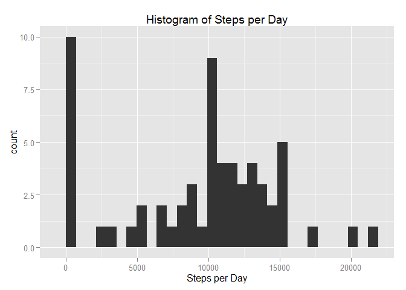
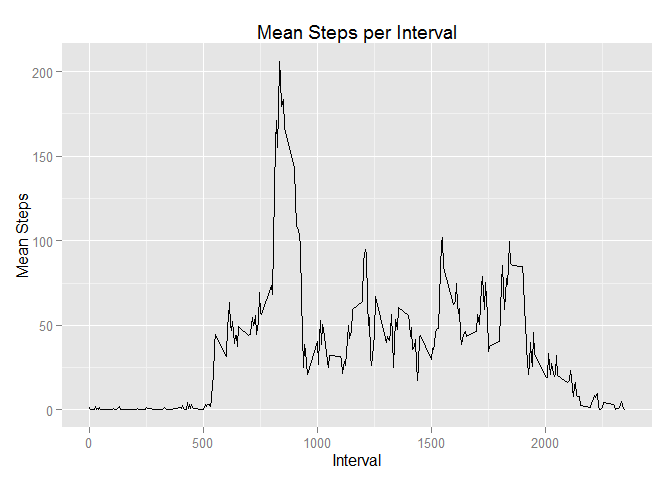
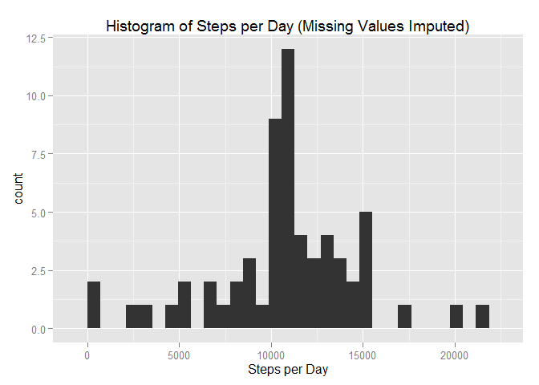
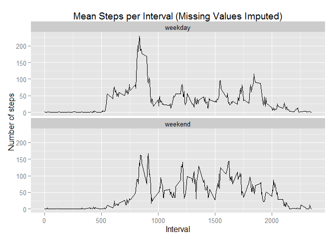

# Reproducible Research: Peer Assessment 1


## Loading and preprocessing the data

```r
stepup <- read.csv("./activity/activity.csv",na.strings="NA",colClasses=c("numeric","character","character"))
library(ggplot2)
```

```
## Warning: package 'ggplot2' was built under R version 3.2.1
```

```r
library(plyr)
```

```
## Warning: package 'plyr' was built under R version 3.2.1
```

```r
library(lubridate)
```

```
## Warning: package 'lubridate' was built under R version 3.2.1
```

```
## 
## Attaching package: 'lubridate'
## 
## The following object is masked from 'package:plyr':
## 
##     here
```
## What is mean total number of steps taken per day?

```r
days <- ddply(stepup,"date",summarize,steps=sum(steps,na.rm=TRUE))
qplot(steps,data=days)+labs(title="Histogram of Steps per Day",x="Steps per Day")
```

```
## stat_bin: binwidth defaulted to range/30. Use 'binwidth = x' to adjust this.
```

 

Mean and Median of the total number of steps taken per day

```r
mean(days$steps)
```

```
## [1] 9354.23
```

```r
median(days$steps)
```

```
## [1] 10395
```
## What is the average daily activity pattern?

```r
intervalmean <- ddply(stepup, "interval", summarize, mean=mean(steps, na.rm=TRUE))
```


```r
ggplot(intervalmean, aes(as.numeric(interval),as.numeric(mean),group=1))+geom_line()+labs(title="Mean Steps per Interval",x="Interval",y="Mean Steps")
```

 

5-minute interval, on average across all the days in the dataset, that contains the maximum number of steps

```r
intervalmean[which.max(intervalmean[,2]),1]
```

```
## [1] "835"
```
## Imputing missing values
The total number of missing values in the dataset

```r
length(which(is.na(stepup$steps)))
```

```
## [1] 2304
```


```r
impute.mean <- function(x) replace(x, is.na(x), mean(x, na.rm = TRUE))
stepup2 <- ddply(stepup, ~ interval, transform, steps = impute.mean(steps))
stepup2 <- stepup2[order(stepup2$date,stepup2$interval),]
days2 <- ddply(stepup2,"date",summarize,steps=sum(steps,na.rm=TRUE))
qplot(steps,data=days2)+labs(title="Histogram of Steps per Day (Missing Values Imputed)",x="Steps per Day")
```

```
## stat_bin: binwidth defaulted to range/30. Use 'binwidth = x' to adjust this.
```

 

Mean and Median of the total number of steps taken per day with NAs removed

```r
mean(days2$steps)
```

```
## [1] 10766.19
```

```r
median(days2$steps)
```

```
## [1] 10766.19
```

Both the mean and median have increased after imputing missing data. The mean increased a lot, which makes sense because treating NAs as zeroes dragged the mean down, while the median increased not as much, which makes sense because the original median without NAs removed was closer to the mean and with all days with NA replaced by the mean steps and thus cluttering up the center of the order, the median merely became the mean.

Imputing missing data (when based on a summary statistic) makes the data look less variable than it would have otherwise, since you are filling the data set with averages which are inherently not variable.

## Are there differences in activity patterns between weekdays and weekends?

```r
stepup2 <- mutate(stepup2, weekend = wday(ymd(date)) %in% c(1,7))
stepup2$weekend <- mapvalues(stepup2$weekend,from=c(TRUE,FALSE),to=c("weekend","weekday"))
stepup2$weekend <- as.factor(stepup2$weekend)
intervalmean2 <- ddply(stepup2, c("interval","weekend"), summarize, mean=mean(steps, na.rm=TRUE))
ggplot(intervalmean2,aes(as.numeric(interval),as.numeric(mean),group=1))+facet_wrap(~weekend,ncol=1)+xlab("Interval")+ylab("Number of steps")+ggtitle("Mean Steps per Interval (Missing Values Imputed)")+geom_line()
```

 
